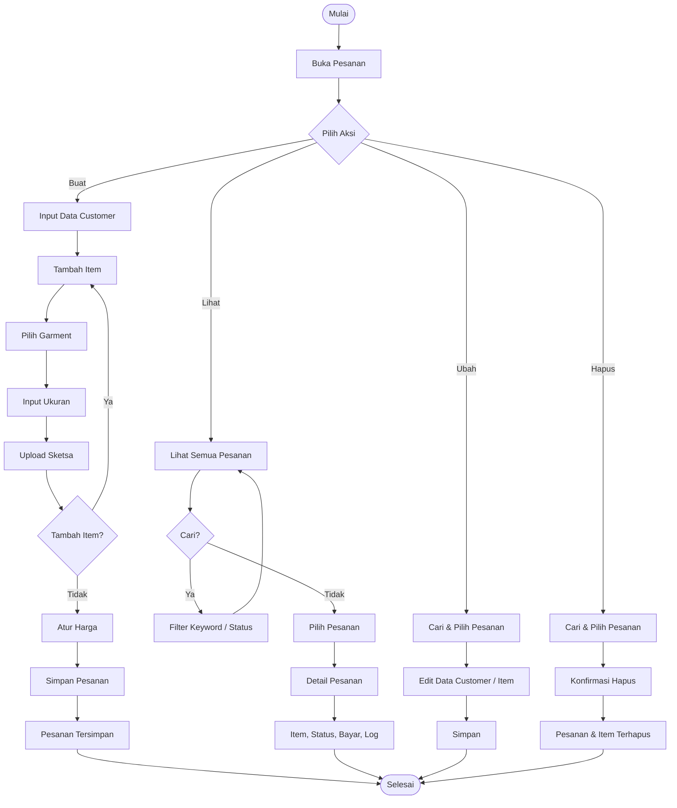
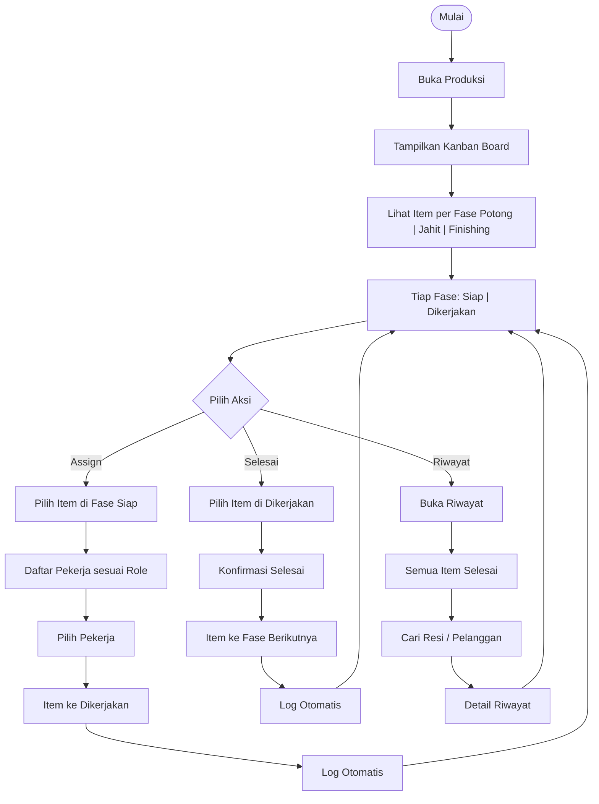
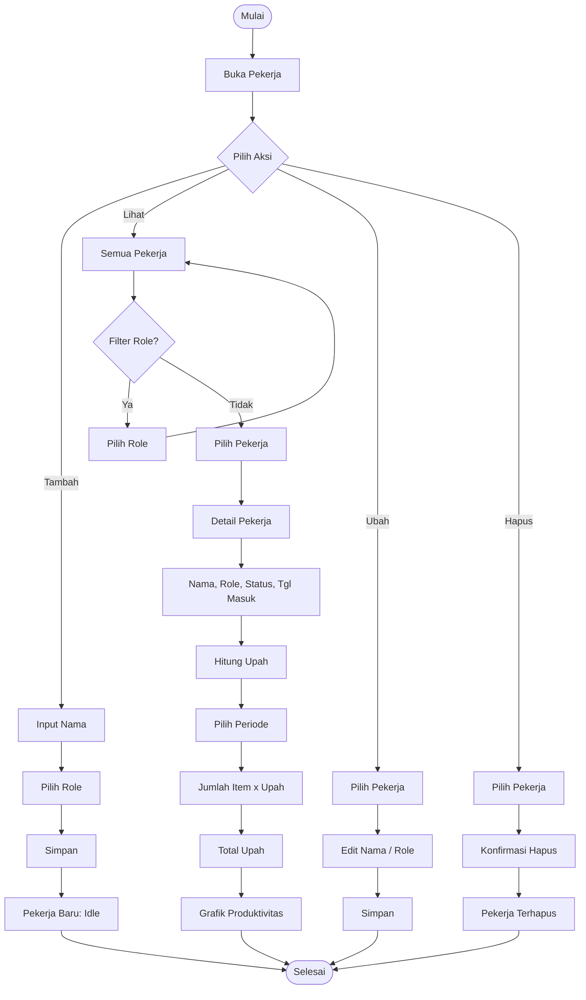
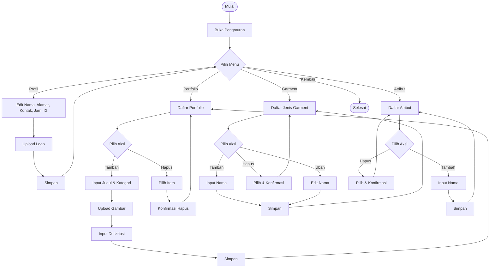
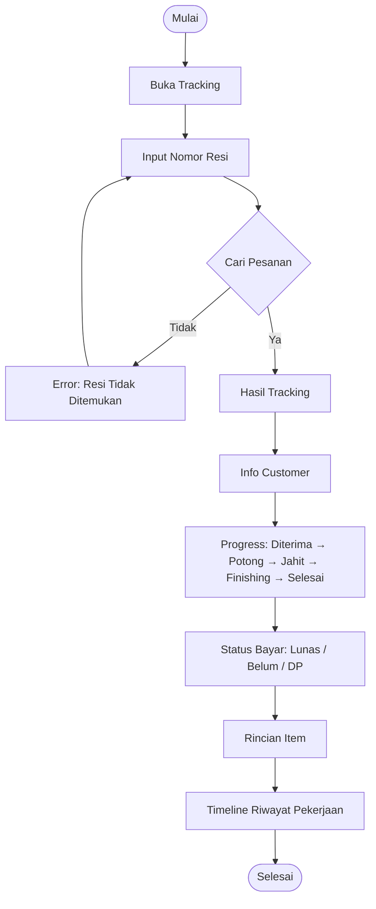
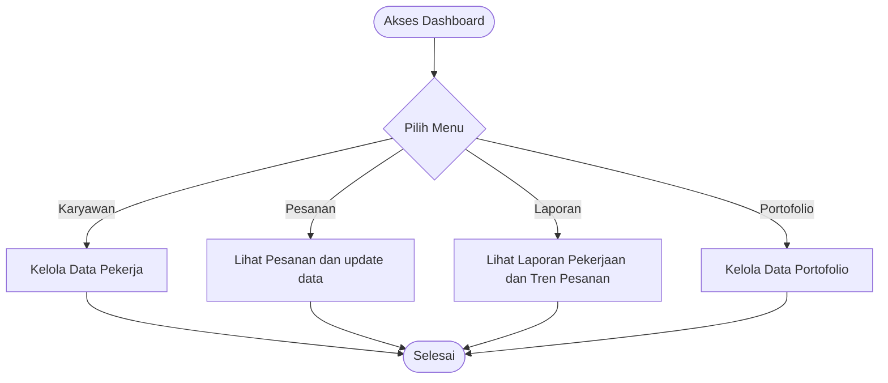
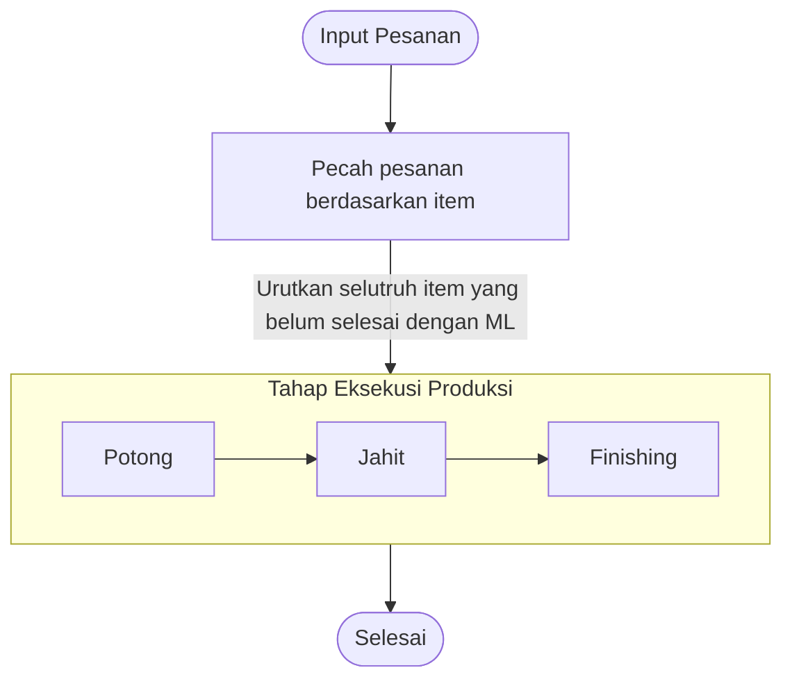

# Activity Diagram — Konveksi Management System

Aktor: **User** (1 role — merangkap admin + operator produksi)

---

## 1. Kelola Pesanan



---

## 2. Produksi (Kanban Board)



---

## 3. Kelola Pekerja



---

## 4. Dashboard & Laporan

```mermaid
flowchart TD
    A([Mulai]) --> B[Buka Dashboard]

    B --> C[Ringkasan: Pesanan Aktif, Pendapatan, Selesai Hari Ini]
    C --> D[Grafik Tren 7 Hari]
    D --> E[Notifikasi Deadline: Kritis | Tinggi | Sedang]

    E --> F{Pilih Laporan}

    F -->|Volume| G[Laporan Volume Pesanan]
    G --> H[Pilih Periode]
    H --> I[Grafik Volume]
    I --> F

    F -->|Tren Produk| J[Laporan Tren Produk]
    J --> K[Grafik Garment Terpopuler]
    K --> F

    F -->|Produktivitas| L[Laporan Produktivitas]
    L --> M[Item Selesai per Pekerja + Rata-rata Waktu]
    M --> F

    F -->|Selesai| N([Selesai])
```

---

## 5. Pengaturan



---

## 6. Tracking Pesanan (Publik)



### 7. Menu



---

## Catatan

- Semua aktivitas dilakukan oleh **1 aktor tunggal** (User) yang menangani seluruh aspek operasional.
- Diagram dibuat dengan [Mermaid.js](https://mermaid.js.org/) — dapat dirender langsung di GitHub, GitLab, Notion, atau editor Mermaid.
